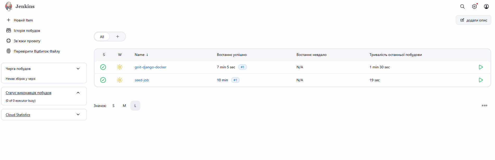
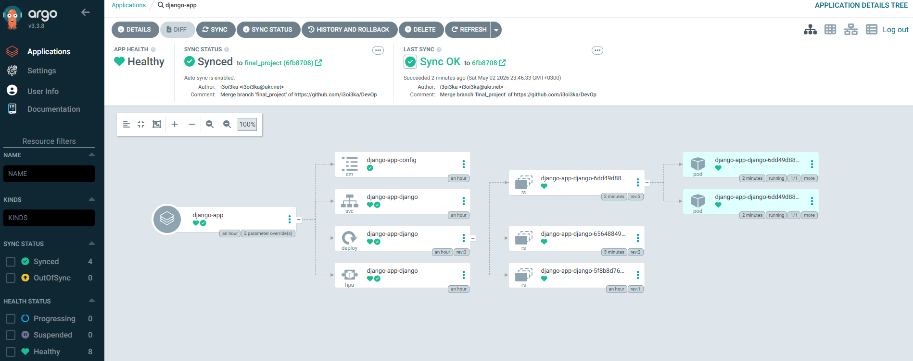
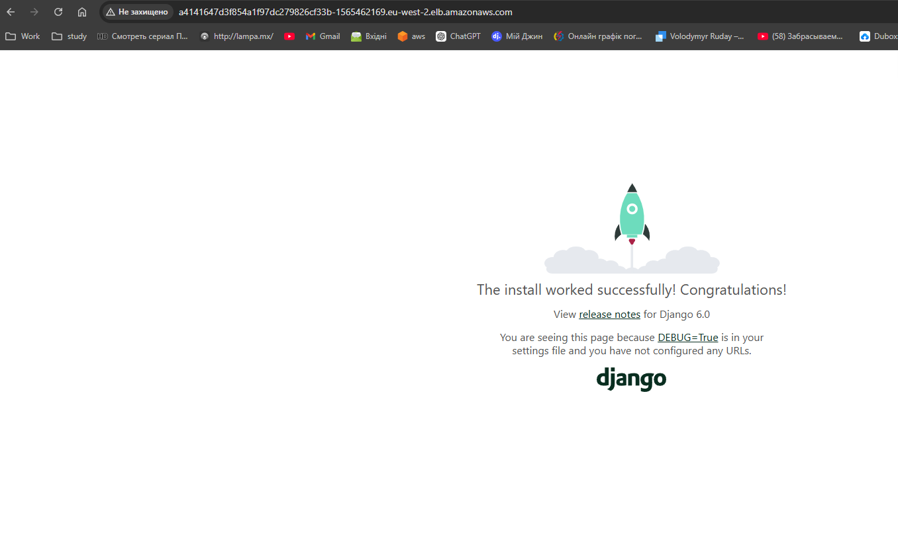
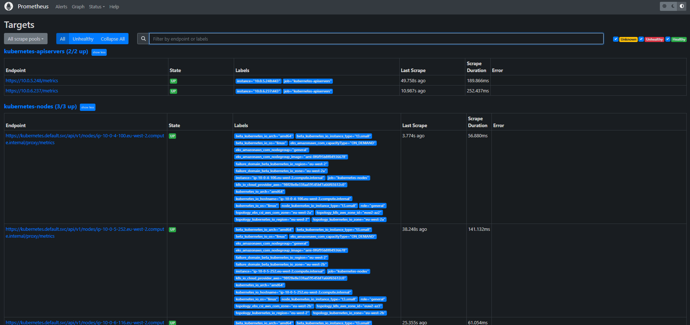
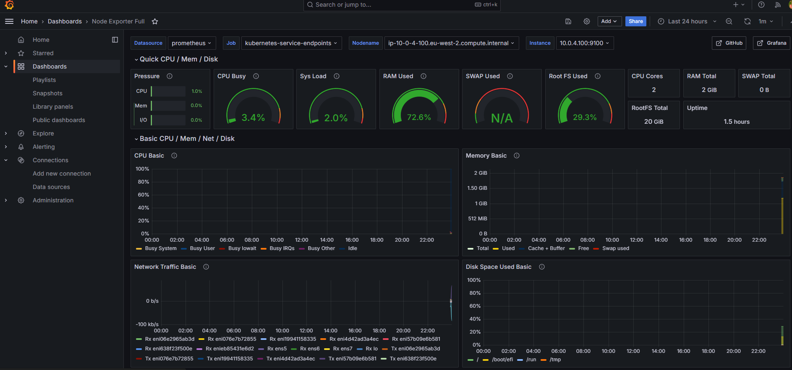

# 🚀 AWS End-to-End GitOps Infrastructure

Цей проєкт реалізує повний CI/CD цикл (GitOps) для Django-застосунку в хмарі AWS. Інфраструктура розгорнута за допомогою **Terraform**, автоматизація збірки — через **Jenkins**, а безперервна доставка — через **Argo CD**. Для зберігання стану Terraform використовується **S3** з блокуванням через **DynamoDB**. Моніторинг забезпечує стек **Prometheus + Grafana**.

---

## 🏗 Архітектура та CI/CD процес

Проєкт реалізує сучасний підхід **GitOps**:

1. **Infrastructure as Code**: Весь кластер (VPC, EKS, ECR, RDS, S3 Backend, DynamoDB Lock) керується через Terraform.
2. **Continuous Integration**: Jenkins у Kubernetes використовує **Kaniko** для збірки Docker-образів без доступу до Docker-сокету хоста (Docker-in-Docker/Docker-less).
3. **Continuous Deployment**: Argo CD відстежує зміни в Helm-чарті та автоматично синхронізує стан кластера з Git.
4. **Моніторинг**: Prometheus збирає метрики, а Grafana візуалізує їх для спостереження за станом кластера та додатку.

---

## 📁 Структура проєкту

- **`charts/django-app/`**: Helm-чарт вашого додатку (Deployment, Service LoadBalancer, HPA, ConfigMap).
- **`django_app/`**: Код вашого Django-застосунку (можна замінити на будь-який інший).
- **`modules/`**:
  - `s3-backend`: Створення S3 та DynamoDB для Remote State та State Locking.
  - `vpc`: Мережева інфраструктура (Public/Private subnets, Internet Gateway, NAT).
  - `ecr`: Репозиторій для зберігання Docker-образів.
  - `eks`: Кластер Kubernetes та керовані групи вузлів (Managed Node Groups) + CSI Driver.
  - `jenkins`: Розгортання Jenkins через Helm (з налаштованими Kubernetes Clouds та агентами).
  - `argo_cd`: Розгортання Argo CD з використанням паттерну **App-of-Apps** (включає локальний чарт для автоматичного керування застосунками).
  - `rds`: Модуль для розгортання бази даних RDS (опціонально Aurora).
  - `monitoring`: Розгортання Prometheus та Grafana для моніторингу кластера.
- **`backend.tf`**: Налаштування віддаленого збереження стану в S3.
- **`jenkinsfile`**: Конфігурація Jenkins Pipeline для CI/CD процесу.
- **`main.tf`**, **`variables.tf`**, **`outputs.tf`**: Головні конфігураційні файли Terraform.
- **`terraform.tfvars`**: Файл для передачі власних значень змінних (не включений до репозиторію).

---

## 🛠 Prerequisites (Підготовка)

Перед початком роботи переконайтеся, що у вас встановлено та налаштовано:

- **Terraform** (версії 1.0 або новішої)
- **AWS CLI** (налаштований через команду `aws configure`)
- **kubectl** (для взаємодії з кластером Kubernetes)
- **Helm** (для роботи з чартами)
- **GitHub Personal Access Token (PAT)** з правами на читання/запис у репозиторій.

---

## ⚙️ Змінні (Variables)

Проєкт підтримує гнучке налаштування через змінні. Оголошені наступні параметри:

| Назва                    | Опис                                                            | Тип            | За замовчуванням                                |
| :----------------------- | :-------------------------------------------------------------- | :------------- | :---------------------------------------------- |
| `bucket_name`            | Назва S3 бакета для збереження стану Terraform                  | `string`       | `ruday-terraform-state-bucket-devOps`           |
| `table_name`             | Назва DynamoDB таблиці для блокування стану Terraform           | `string`       | `ruday-terraform-locks-devOps`                  |
| `vpc_name`               | Ім'я VPC                                                        | `string`       | `DevOps-vpc`                                    |
| `vpc_cidr_block`         | CIDR блок для VPC                                               | `string`       | `10.0.0.0/16`                                   |
| `public_subnets`         | Список CIDR блоків для публічних підмереж                       | `list(string)` | `["10.0.1.0/24", "10.0.2.0/24", "10.0.3.0/24"]` |
| `private_subnets`        | Список CIDR блоків для приватних підмереж                       | `list(string)` | `["10.0.4.0/24", "10.0.5.0/24", "10.0.6.0/24"]` |
| `availability_zones`     | Список зон доступності для підмереж                             | `list(string)` | `["eu-west-2a", "eu-west-2b", "eu-west-2c"]`    |
| `ecr_name`               | Назва ECR репозиторію                                           | `string`       | `DevOps-ecr-repository`                         |
| `scan_on_push`           | Чи вмикати сканування образів при завантаженні                  | `bool`         | `true`                                          |
| `region`                 | AWS region for deployment                                       | `string`       | `eu-west-2`                                     |
| `cluster_name`           | Name of the EKS cluster                                         | `string`       | `DevOps-eks-cluster`                            |
| `node_group_name`        | Name of the node group                                          | `string`       | `DevOps-node-group`                             |
| `instance_type`          | EC2 instance type for the worker nodes                          | `string`       | `t3.small`                                      |
| `desired_size`           | Desired number of worker nodes                                  | `number`       | `3`                                             |
| `max_size`               | Maximum number of worker nodes                                  | `number`       | `4`                                             |
| `min_size`               | Minimum number of worker nodes                                  | `number`       | `1`                                             |
| `name`                   | Назва Helm-релізу Argo CD                                       | `string`       | `argo-cd`                                       |
| `namespace`              | K8s namespace для Argo CD                                       | `string`       | `argocd`                                        |
| `chart_version`          | Версія Argo CD чарта                                            | `string`       | `9.5.4`                                         |
| `use_aurora`             | Вибір типу БД: `true` (Aurora), `false` (RDS)                   | `bool`         | `false`                                         |
| `rds_cluster_name`       | Назва кластера/інстанса БД                                      | `string`       | `null` / обов'язково                            |
| `engine`                 | Рушій для звичайної RDS                                         | `string`       | `postgres`                                      |
| `engine_cluster`         | Рушій для Aurora                                                | `string`       | `aurora-postgresql`                             |
| `engine_version`         | Версія рушія БD                                                 | `string`       | `17.9` (для RDS), `15.8` (для Aurora)           |
| `instance_class`         | Клас інстансу БD                                                | `string`       | `db.t3.micro`                                   |
| `db_name`                | Основна назва бази даних                                        | `string`       | `null` / обов'язково                            |
| `username`               | Головний користувач БД (Master username)                        | `string`       | `null` / обов'язково                            |
| `password`               | Пароль користувача БD                                           | `string`       | `null` / обов'язково                            |
| `multi_az`               | Підтримка Multi-AZ                                              | `bool`         | `false`                                         |
| `github_username`        | Ваш логін на GitHub для Jenkins credentials                     | `string`       | `null` / обов'язково                            |
| `github_token`           | Ваш GitHub Personal Access Token для Jenkins                    | `string`       | `null` / обов'язково                            |
| `django_secret_key`      | Секретний ключ для Django (передається через Kubernetes Secret) | `string`       | `null` / обов'язково                            |
| `jenkins_admin_password` | Пароль адміністратора Jenkins (передається через Helm values)   | `string`       | `null` / обов'язково                            |
| `grafana_admin_password` | Пароль адміністратора Grafana (передається через Helm values)   | `string`       | `null` / обов'язково                            |

---

### Приклад конфігурації `terraform.tfvars:`

Створіть цей файл у кореневій директорії проєкту, щоб передати власні значення:

```hcl
bucket_name        = "your-unique-bucket-name"
table_name         = "your-unique-table-name"
vpc_name           = "your-vpc-name"
ecr_name           = "your-ecr-repository-name"
region             = "your-aws-region"
cluster_name       = "your-eks-cluster-name"
node_group_name    = "your-node-group-name"
instance_type      = "t3.small"
desired_size       = 3
name               = "your-argo-cd-release-name"
django_secret_key = "your-django-secret-key"
github_username  = "your-github-username"
github_token     = "your-github-personal-access-token"
jenkins_admin_password = "your-jenkins-admin-password"
grafana_admin_password = "your-grafana-admin-password"
# Конфігурація для БД (RDS/Aurora)
use_aurora         = false
rds_cluster_name   = "my-app-db"
engine             = "postgres"
engine_version     = "17.9"
instance_class     = "db.t3.micro"
db_name            = "mydatabase"
username           = "dbadmin"
password           = "SuperSecretPassword123!"
```

## 🗄️ Модуль `rds` (База Даних)

Модуль надає універсальне рішення:

- `use_aurora = true` → Створює кластер **AWS Aurora** (Cluster + Writer Instance + опціонально Readers).
- `use_aurora = false` → Створює звичайний інстанс БД **AWS RDS** (Single/Multi-AZ).

В обох варіантах автоматично:

- Створюється `aws_db_subnet_group` у приватних підмережах VPC.
- Налаштовується `aws_security_group` для доступу до БД.
- Створюється Parameter Group із базовими налаштуваннями (`max_connections`, `log_statement`, `work_mem`, тощо).

**Як змінити тип БД або параметри:**

- Для переходу на Aurora змініть значення `use_aurora = true`. Якщо не змінювати детальних параметрів (engine, engine_version), модуль використає вбудовані дефолти: `aurora-postgresql` та `15.8` відповідно.
- Тип машини можна змінити у змінній `instance_class` (наприклад, `db.t3.medium`).
- Якщо потрібен MySQL замість PostgreSQL, вкажіть відповідні рушії `engine="mysql"` і `engine_version="8.0"`.

## 🚀 Порядок розгортання

### 1. Bootstrapping (Перший запуск інфраструктури)

Оскільки проєкт використовує S3 для збереження стану, який сам же і створює, перший запуск має відбуватися так:

1. Закоментуйте весь вміст файлу `backend.tf`.
2. Виконайте ініціалізацію та створення ресурсів:

   ```bash
   terraform init
   terraform apply
   ```

3. Розкоментуйте `backend.tf`, впишіть туди назву створеного бакету та таблиці DynamoDB.
4. Виконайте `terraform init` ще раз і погодьтеся на міграцію стейту в AWS (`yes`).
5. Знову виконайте `terraform apply` для завершення розгортання всієї інфраструктури.

### 2. Секрети додатку (Kubernetes)

Підключення до EKS:

```bash
aws eks --region <region> update-kubeconfig --name <cluster_name>
```

### 3. Налаштування Jenkins

Для отримання посилання на load balancer Jenkins виконайте команду:

```bash
kubectl get svc -n jenkins jenkins -o jsonpath='{.status.loadBalancer.ingress[0].hostname}'
```

Зробіть build у Jenkins, щоб ініціювати перший запуск. Jenkins автоматично створить тимчасовий Pod з контейнерами Git та Kaniko для збірки образу та пушу в ECR.



### 4. Налаштування Argo CD

Argo CD автоматично розгортається та налаштовується модулем Terraform.
Для отримання посилання на сервіс Argo CD виконайте команду:

```bash
kubectl get svc -n argocd argocd-server -o jsonpath='{.status.loadBalancer.ingress[0].hostname}'
```

- **Логін**: `admin`
- **Пароль**: Отримайте з кластера командою:

  ```bash
  kubectl -n argocd get secret argocd-initial-admin-secret -o jsonpath="{.data.password}" | base64 -d
  ```

  

## 🔄 Як працює автоматизація (CI/CD Workflow)

1. **Push**: Ви робите коміт у Git-репозиторій (зміни в коді Django).
2. **Jenkins Build**: Jenkins автоматично виявляє зміни (через Poll SCM), запускає тимчасовий Pod у Kubernetes з контейнерами **Git** та **Kaniko**.
3. **Build & Push**: Kaniko збирає новий Docker-образ і пушить його в Amazon ECR з унікальним тегом (номер білда `${BUILD_NUMBER}`).
4. **GitOps Update (CD Trigger)**: Jenkins клонує репозиторій, змінює значення `tag:` у файлі `charts/django-app/values.yaml` на нове та робить `git push` назад у репозиторій.
5. **Argo CD Sync**: Argo CD постійно сканує репозиторій. Побачивши новий тег у `values.yaml`, він ініціює синхронізацію і виконує Rolling Update подів Django у кластері без простою.

---

## ⚙️ Команди для перевірки

- **Отримати URL вашого працюючого веб-додатку Django**:

  ```bash
    kubectl get svc django-app-django -o jsonpath='{.status.loadBalancer.ingress[0].hostname}'
  ```

  

- **Перевірити статуси подів додатку**:

  ```bash
  kubectl get pods -n default
  ```

- **Статус синхронізації Argo CD через CLI**:

  ```bash
  kubectl get applications -n argocd
  ```

- **Знищення всієї інфраструктури (Clean up)**:

  ```bash
  terraform destroy
  ```

## 📊 Модуль `monitoring` (Прометеус та Графана)

Модуль `monitoring` встановлює повноцінний стек спостереження за кластером EKS за допомогою **Prometheus** та **Grafana**.
Він розгортається автоматично як Helm реліз у неймспейсі `monitoring`.

### 1. Prometheus

Prometheus налаштований для збору метрик з вузлів (через Node Exporter), подів, сервісів та самого Kubernetes (через kube-state-metrics).



### 2. Grafana

Grafana використовується для візуалізації зібраних метрик. Вона автоматично підключає Prometheus як Data Source.

Щоб отримати доступ до Grafana:

```bash
kubectl port-forward svc/prometheus-grafana 3000:80 -n monitoring
```

Підключіть в data source URL `http://prometheus-server:80` (внутрішній сервіс Prometheus у кластері).
Dashboard потрібно налаштувати вручну, але ви можете імпортувати готові шаблони для EKS, які доступні в офіційній бібліотеці Grafana.



## 📤 Outputs (Вихідні дані)

Після завершення `terraform apply` ви отримаєте:

- `s3_bucket_name`: Назва S3-бакета для стейту.
- `dynamodb_table_name`: Назва таблиці DynamoDB для блокування.
- `vpc_id`: Ідентифікатор мережі.
- `public_subnets`: Список публічних підмереж.
- `private_subnets`: Список приватних підмереж.
- `internet_gateway_id`: Ідентифікатор інтернет-шлюзу.
- `cluster_endpoint`: URL-адреса API сервера EKS.
- `cluster_name`: Ім'я кластера EKS.
- `eks_node_role_arn`: ARN ролі для вузлів EKS.
- `ecr_repository_url`: URL вашого ECR репозиторію.
- `jenkins_release`: Назва релізу Jenkins.
- `jenkins_namespace`: Простір імен для Jenkins.
- `argo_cd_server_service`: URL-адреса сервісу Argo CD
- `admin_password`: Пароль адміністратора Argo CD.
- `rds_endpoint`: Ендпойнт розгорнутої бази даних (стандартної RDS або Aurora).
- `rds_port`: Порт для підключення до бази даних.
- `rds_database_name`: Назва створеної бази даних (`db_name`).
- `db_security_group_id`: ID створеної Security Group для бази даних.
- `grafana_url`: URL-адреса сервісу Grafana.
- `prometheus_url`: URL-адреса сервісу Prometheus.

---
